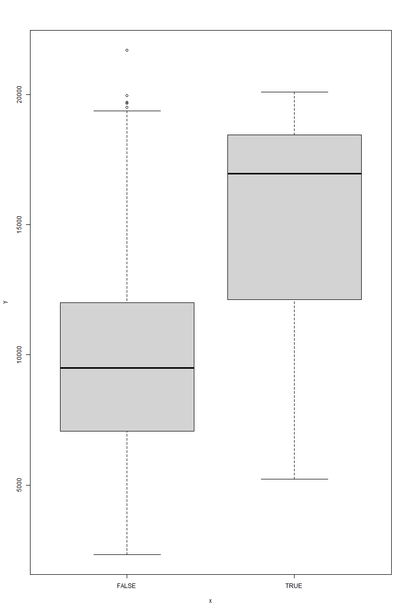

<span style="font-family:Cascadia code; font-weight:250">

<details>
    <summary>Встановлення variant та seed</summary>

```R
get_percentage <- function(group, student_position) {
  set.seed(group * 25 + student_position)
  round(runif(1, min = group + 5, max = 25 - group)) / 100
}
```

</details>

<details>
    <summary>Перше завдання</summary>

## Зчитування з файлу
```R
collage_dataset <- read.csv("e:\\Programming\\R\\RLabs\\RFirstLab\\College.csv", header = TRUE)
```

## Зміна даних за варіантом

Для зміни даних за варіантом використовується функція `remove`:

```R
remove <- function(dataset, percentage) {
  dataset[-get_indexes(dataset, percentage), ]
}
```

Функція `get_indexes` генерує набір випадкових індексів, у діапазоні від 1 до довжини датасету.

```R
get_indexes <- function(dataset, percentage) {
  sample(seq(from = 1, to = length(dataset[, 1])),
         round(length(dataset[, 1]) * percentage))
}
```
## Переглянути за допомогою функції `fix` інформацію про датасет

```R
fix(collage_dataset_varianted)
```

**Результат:**


## Забрати колонку з назвами закладів
```R
collages_without_names <- collage_dataset_varianted[, -1]
```

Для того, щоб у функції pairs можна було передати увесь датасет, замінимо значення `Yes`, `No` на 1 та 0 відповідно.

```R
collages_without_names$Private <-
  ifelse(collages_without_names$Private == "Yes", 1, 0)
```

**Результат**


## Використання функцій `summary` та `pairs`.

### `Summary`:
```
    Private            Apps           Accept            Enroll      
 Min.   :0.0000   Min.   :  100   Min.   :   90.0   Min.   :  35.0
 1st Qu.:0.0000   1st Qu.:  786   1st Qu.:  611.5   1st Qu.: 243.5  
 Median :1.0000   Median : 1557   Median : 1110.0   Median : 434.0
 Mean   :0.7245   Mean   : 3024   Mean   : 2035.9   Mean   : 792.0
 3rd Qu.:1.0000   3rd Qu.: 3712   3rd Qu.: 2459.5   3rd Qu.: 910.5
 Max.   :1.0000   Max.   :48094   Max.   :26330.0   Max.   :6392.0
   Top10perc       Top25perc       F.Undergrad     P.Undergrad
 Min.   : 1.00   Min.   :  9.00   Min.   :  199   Min.   :    1.0  
 1st Qu.:15.00   1st Qu.: 41.00   1st Qu.:  981   1st Qu.:   98.0
 Median :23.00   Median : 54.00   Median : 1715   Median :  370.0
 Mean   :27.49   Mean   : 55.64   Mean   : 3741   Mean   :  861.8
 3rd Qu.:35.00   3rd Qu.: 68.00   3rd Qu.: 4228   3rd Qu.:  976.0
 Max.   :96.00   Max.   :100.00   Max.   :31643   Max.   :21836.0  
    Outstate       Room.Board       Books           Personal
 Min.   : 2340   Min.   :1780   Min.   :  96.0   Min.   : 250.0
 1st Qu.: 7290   1st Qu.:3600   1st Qu.: 470.0   1st Qu.: 877.5
 Median : 9900   Median :4200   Median : 500.0   Median :1200.0
 Mean   :10384   Mean   :4357   Mean   : 548.8   Mean   :1337.7  
 3rd Qu.:12761   3rd Qu.:5032   3rd Qu.: 600.0   3rd Qu.:1660.0
 Max.   :21700   Max.   :8124   Max.   :2000.0   Max.   :6800.0
      PhD            Terminal       S.F.Ratio      perc.alumni
 Min.   : 10.00   Min.   : 24.0   Min.   : 2.90   Min.   : 0.00
 1st Qu.: 62.00   1st Qu.: 71.0   1st Qu.:11.50   1st Qu.:13.00
 Median : 75.00   Median : 82.0   Median :13.60   Median :21.00  
 Mean   : 72.74   Mean   : 79.7   Mean   :14.13   Mean   :22.58
 3rd Qu.: 85.00   3rd Qu.: 92.0   3rd Qu.:16.50   3rd Qu.:31.00
 Max.   :100.00   Max.   :100.0   Max.   :39.80   Max.   :64.00
     Expend        Grad.Rate
 Min.   : 3186   Min.   : 10.00
 1st Qu.: 6738   1st Qu.: 54.00
 Median : 8354   Median : 66.00  
 Mean   : 9671   Mean   : 65.79
 3rd Qu.:10816   3rd Qu.: 78.00
 Max.   :56233   Max.   :118.00
```
### `Pairs`:


Побудуємо графік довільних трьох стовпців даних.
```R
pairs(data.frame(collages_without_names$Accept,
                 collages_without_names$Top25perc,
                 collages_without_names$PhD))
```
Розглянемо результати.


## Побудова діаграми Outstate vs Private
```R
plot(collages_without_names$Outstate, collages_without_names$Private)
```
```R
plot(collages_without_names[c("Outstate", "Private")])
```


> З рисунку можна зробити висновок, що більшість приватних шкіл знаходяться за межами штату.

## Створення якісного показника Elite
```R
elite <- rep(FALSE, nrow(collages_without_names))
elite[collages_without_names$Top10perc > 50] <- TRUE
elite <- as.logical(elite)
collages_without_names <- data.frame(collages_without_names, elite)
```
**Для чого останні дві команди?**
> Для додавання колонки `elite` до датафрейму. При об'єднанні цих стрічок коду в одну, назва колонки перетвориться з `elite` на `as.logical(elite)`.


**Чи багато таких університетів?**
```R
print(length(which(elite)))
print(sum(elite == FALSE, na.rm = TRUE))
```
> [1] 72 </br>
[1] 643

**Побудувати діаграму Outstate vs Elite**
```R
plot(elite, collages_without_names$Outstate)
```


>З графіку можна зробити висново, що більшість елітних шкіл знаходяться в штаті.
</details>

<details>

<summary>Друге завдання</summary>

## Додати бібліотеку MASS
```R
library(MASS)
```

## Обрізати датафрейм за допомогою `sample`

```R
boston_varianted <- remove(Boston, percentage)
```

## Дати відповіді на запитання:

**Скільки рядків та стовпців міститься у датафреймі**

```R
print(nrow(Boston))
print(ncol(Boston))
print(nrow(boston_varianted))
```

> [Кількість рядків] 506 </br>
[Кількість стовпців] 14 </br>
[Кількість модифікованих рядків] 466


**Скільки кварталів межують з річкою Charles**

```R
print(sum(boston_varianted$chas == 1))
```

> 34

**Обчисліть медіану для відношення учні-вчителі для міста загалом**

```R
print(median(boston_varianted$ptratio))
```

>19.1

**Які вквартали мають найбільше та найменше значення відношення учні-вчителі**

```R
print(which.min(boston_varianted$ptratio))
print(which.max(boston_varianted$ptratio))
```

>183 (12.60) </br>
330 (22.00)

**В яких кварталах в середньому є:**

<details>
    <summary>більше 7 кімнат в помешкані</summary>

```R
print(which(boston_varianted$rm > 7))
```
>[1]   3   5  40  61  83  84  92  93  94 152 153 154 157 169 171 175 177 180 182</br>
[20] 183 184 185 187 189 190 208 209 210 213 214 218 233 236 237 238 240 241 242</br>
[39] 243 244 246 247 252 255 259 260 261 262 269 277 282 284 318 339 344 349 419</br>
[58] 445</br>

</details>

<details>
    <summary>більше 8 кімнат в помешкані</summary>

```R
print(which(boston_varianted$rm > 8))
```

>[1]  92 154 190 208 214 233 237 242 339

</details>

<details>
    <summary>більше 4, але менше 7 кімнат в помешкані</summary>

```R
print(which(boston_varianted$rm > 4 & boston_varianted$rm < 7))
```

>[1]   1   2   4   6   7   8   9  10  11  12  13  14  15  16  17  18  19  20</br>
 [19]  21  22  23  24  25  26  27  28  29  30  31  32  33  34  35  36  37  38</br>
 [37]  39  41  42  43  44  45  46  47  48  49  50  51  52  53  54  55  56  57</br>
 [55]  58  59  60  62  63  64  65  66  67  68  69  70  71  72  73  74  75  76</br>
 [73]  77  78  79  80  81  82  85  86  87  88  89  90  91  95  96  97  98  99</br>
 [91] 100 101 102 103 104 105 106 107 108 109 110 111 112 113 114 115 116 117</br>
[109] 118 119 120 121 122 123 124 125 126 127 128 129 130 131 132 133 134 135</br>
[127] 136 137 138 139 140 141 142 143 144 145 146 147 148 149 150 151 155 156</br>
[145] 158 159 160 161 162 163 164 165 166 167 168 170 172 173 174 176 178 179</br>
[163] 181 186 188 191 192 193 194 195 196 197 198 199 200 201 202 203 204 205</br>
[181] 206 207 211 212 215 216 217 219 220 221 222 223 224 225 226 227 228 229</br>
[199] 230 231 232 234 235 239 245 248 249 250 251 253 254 256 257 258 263 264</br>
[217] 265 266 267 268 270 271 272 273 274 275 276 278 279 280 281 283 285 286</br>
[235] 287 288 289 290 291 292 293 294 295 296 297 298 299 300 301 302 303 304</br>
[253] 305 306 307 308 309 310 311 312 313 314 315 316 317 319 320 321 322 323</br>
[271] 324 325 326 327 328 329 330 331 332 333 334 335 336 337 338 341 342 343</br>
[289] 345 346 347 348 350 351 352 353 354 355 356 357 358 359 360 361 362 363</br>
[307] 364 365 366 367 368 369 370 371 372 373 374 375 376 377 378 379 380 381</br>
[325] 382 383 384 385 386 387 388 389 390 391 392 393 394 395 396 397 398 399</br>
[343] 400 401 402 403 404 405 406 407 408 409 410 411 412 413 414 415 416 417</br>
[361] 418 420 421 422 423 424 425 426 427 428 429 430 431 432 433 434 435 436</br>
[379] 437 438 439 440 441 442 443 444 446 447 448 449 450 451 452 453 454 455</br>
[397] 456 457 458 459 460 461 462 463 464 465 466</br>

</details>
</span>